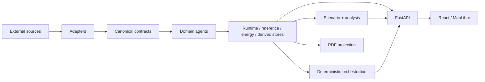

# Berlin Urban Intelligence

**Version 1.0.0**

Berlin Urban Intelligence is a research-oriented, agent-extensible urban intelligence and digital-twin integration platform for Berlin. It integrates heterogeneous urban sources behind typed canonical contracts, preserves provenance, quality and freshness semantics, and supports deterministic cross-domain workflows and explicit hypothetical scenarios without fabricating missing production data.

Version 1.0.0 is the first stable project release. The repository-wide v1 evidence gate is PASS; that means the documented v1 correctness and evidence criteria have been met, not that public data providers are permanently available or that the platform is a production municipal control system.

## Overview

The platform integrates mobility, environmental exposure, heat, energy and resilience capabilities around a shared canonical state model. Its central design requirement is semantic traceability: an observation, official model output, forecast, derived result and scenario value remain distinguishable throughout processing, persistence, analysis and presentation.

The repository is the maintained integration layer. Historical standalone prototypes are reference or migration inputs, not runtime dependencies.

Start with the [documentation index](docs/index.md), [project overview](docs/overview.md), [objectives and scope](docs/objectives-and-scope.md), [v1 verification matrix](docs/verification.md) and [v1.0.0 release notes](docs/releases/v1.0.0.md).

## Motivation

Urban sources differ in update cadence, spatial resolution, authority, quality and epistemic meaning. Treating all inputs as interchangeable values can make stale data appear current, models appear measured, or unavailable domains appear complete through undocumented defaults.

Berlin Urban Intelligence makes those distinctions part of the executable data contract. See [Motivation](docs/motivation.md).

## Key capabilities

| Area | Current implementation |
|---|---|
| Canonical contracts | Frozen Pydantic models with explicit epistemic/data state, quality, UTC time, units, CRS and provenance. |
| Live acquisition | Independent Berlin air-quality, DWD and VBB GTFS-Realtime refresh with source status, last-known-good semantics and a configurable persisted-state worker. |
| Reference acquisition | Official facility/climate WFS data, VBB static GTFS and optional OpenStreetMap road topology. |
| Domain agents | Live State, Mobility, Exposure, Heat, Energy and Resilience agents with machine-readable descriptors, capabilities, dependencies and health. |
| Agent orchestration | Registry-driven deterministic capability resolution and dependency ordering. Execution does not depend on an LLM. |
| Derived information | Persisted derivation definitions, dependency DAGs, incremental recomputation, provenance/upstream lineage and explicit quality/freshness propagation. |
| Cross-domain workflows | Verified Heat + Air Quality and Mobility + Air Quality descriptive products with independent timestamps, explicit non-causal interpretation and no universal score. |
| Energy | Leakage-safe chronological evaluation against persistence/seasonal baselines plus Ridge/gradient-boosting candidates; fingerprint-bound one-step forecast artefacts and reproducible real Berlin evidence from an official 2024 high-voltage load publication. |
| Resilience | Multi-edge weighted routing, route comparison, facility snapping and accessibility under immutable scenario overlays; separate live OSM smoke evidence proves point-in-time real Berlin network/routing compatibility. |
| Critical-route monitoring | Automatically derives nearest reachable cross-category critical-facility routes when the persisted reference/network snapshot changes, caches them in the API and renders them as persistent MapLibre lines with 15 s dashboard polling, keyboard inspection and provenance. Real-time road traffic telemetry is not currently integrated. |
| Scenarios | Explicit bounded heat, energy-demand, network-disruption and infrastructure-degradation scenarios with baseline/scenario/difference separation. |
| Semantic layer | RDF projection with project ontology, PROV-O/SOSA usage, SHACL artefacts, semantic relationship inspection and version-controlled SPARQL examples. |
| Interfaces | FastAPI backend and React/TypeScript/MapLibre research dashboard with provenance, derived, platform and routing/scenario inspection paths. |
| Runtime refresh | Changed validated runtime/reference/energy/derived snapshots are detected without backend restart; invalid replacements retain last-known-good process state and surface diagnostics. |
| Observability | Structured request, source-refresh, reload, derivation-refresh and scenario operation events with allow-listed low-cardinality fields and correlation IDs. |
| Security baseline | Loopback-only default exposure, hardened containers, browser security headers, exception-message redaction, vulnerability-reporting guidance and dependency-audit workflow. |
| Accessibility baseline | Keyboard-accessible principal workflows, a non-pointer routing path and automated Axe regression checks for critical/serious configured WCAG A/AA findings in representative states. |
| Performance evidence | Reproducible hosted-runner benchmark over representative large reference/network fixtures with bounded map responses and explicit non-production-capacity caveats. |
| Verification | Protected Ruff/mypy/Pytest, frontend tests/build, data/knowledge/secret/OpenAPI guards, Docker/Compose and full nginx → FastAPI → persisted state → React/Playwright acceptance, plus separate live-source/security/performance evidence workflows. |

Capabilities remain conditional on source data where appropriate. Real-energy evidence currently uses the clean official **2024 high-voltage load curve** and is intentionally treated as historical rather than current total Berlin demand. OSM-backed routing requires a persisted road snapshot; a successful real Berlin smoke exists for 2026-09-16, but public Overpass availability can regress and failures remain visible rather than being replaced with synthetic topology.

## System architecture



Provider acquisition is explicit and separate from HTTP request handling. Refresh workers validate and atomically replace persisted state; the API watches snapshot identity and reloads only validated changes. Invalid replacements do not displace the last-known-good in-process state. The dashboard polls snapshot tokens and reloads data when persisted state changes. See [Architecture](docs/architecture/overview.md), [components](docs/architecture/components.md) and [data flow](docs/architecture/data-flow.md).

## Repository structure

```text
config/                         source registry
data/                           generated/runtime data boundary
docs/                           technical, evaluation and release documentation
frontend/                       React + TypeScript + MapLibre dashboard
knowledge/                      ontology, SHACL and SPARQL artefacts
scripts/                        acquisition/evaluation/validation commands
src/berlin_urban_intelligence/  backend implementation
tests/                          deterministic backend and release-contract tests
```

See [Project structure](docs/implementation/project-structure.md).

## Quick start

### Docker Compose

```bash
docker compose up --build
```

The default composition starts the backend, dashboard and live refresh worker. The worker refreshes persisted live state every 300 seconds by default. Override the cadence, for example:

```bash
BUI_REFRESH_INTERVAL_SECONDS=60 docker compose up --build
```

Then open:

- dashboard: `http://localhost:8080`
- OpenAPI: `http://localhost:8000/docs`

Validated replacement snapshots become visible without restarting the API. Malformed replacements are reported through `/api/v1/system` and the last-known-good state remains active.

For local Python/Node installation, reference layers and optional OSM, see [Installation](docs/usage/installation.md) and [Quickstart](docs/usage/quickstart.md).

## Example workflow

Acquire current live state once:

```bash
python scripts/refresh_live.py
```

Run a persistent local refresh worker:

```bash
python scripts/refresh_live.py --interval-seconds 300
```

Acquire official reference layers and VBB static GTFS:

```bash
python scripts/refresh_reference.py
```

Optional OSM acquisition is explicit:

```bash
python scripts/refresh_reference.py --with-osm
```

Run the API:

```bash
uvicorn berlin_urban_intelligence.api.app:app --host 0.0.0.0 --port 8000
```

Inspect domain/source health and snapshot reload state:

```bash
curl http://localhost:8000/api/v1/agents/health
curl http://localhost:8000/api/v1/source-status
curl http://localhost:8000/api/v1/system
```

More examples, including scenarios and resilience requests: [Usage examples](docs/usage/examples.md).

## Testing and evidence

Backend CI uses Python 3.12 and runs Ruff formatting/lint, strict mypy, the complete Pytest suite with coverage reporting, ontology validation, production-data and secret guards, plus OpenAPI generation. Frontend CI runs unit tests and a production build. The protected container job validates Compose, builds both application images, seeds deterministic persisted acceptance state and exercises the composed application through Playwright.

External-provider compatibility, dependency security, performance and real-data evaluation are deliberately separated from deterministic correctness CI so upstream availability does not turn repository correctness checks nondeterministic.

The authoritative completion evidence is [docs/verification.md](docs/verification.md). Detailed point-in-time source evidence includes [real Berlin energy](docs/energy-real-evidence.md) and [real OSM road-network readiness](docs/road-network-verification.md). Current post-v1 automatic routing behavior is documented in [dynamic critical-route monitoring](docs/critical-route-monitoring.md).

## Documentation

The documentation is organized for external engineering and research use:

- [Documentation index](docs/index.md)
- [Concepts and terminology](docs/concepts/terminology.md)
- [Architecture](docs/architecture/overview.md)
- [Data architecture](docs/data/overview.md)
- [Implementation](docs/implementation/modules.md)
- [Usage](docs/usage/quickstart.md)
- [Development](docs/development/development-setup.md)
- [Evaluation](docs/evaluation/methodology.md)
- [Research/reproducibility](docs/research/reproducibility.md)
- [v1.0 verification matrix](docs/verification.md)
- [Dynamic critical-route monitoring](docs/critical-route-monitoring.md)
- [v1.0.0 release notes](docs/releases/v1.0.0.md)
- [Changelog](CHANGELOG.md)
- [Roadmap](docs/roadmap.md)
- [Architecture Decision Records](docs/adr/)

## Current status

**v1 evidence gate:** **PASS**. The repository's documented v1 correctness/evidence criteria are satisfied, including protected backend/frontend/container acceptance, real Berlin energy evidence, multiple source-backed cross-domain workflows and point-in-time real Berlin OSM routing readiness.

**Implemented:** typed canonical contracts; live/reference acquisition; persisted source/freshness state; six agents; deterministic registry/capability orchestration; derived dependency/lineage state; source-backed cross-domain products; scenario/resilience calculations; snapshot-bound automatic critical-route monitoring and persistent map visualization; leakage-safe energy evaluation/forecasting; semantic RDF/relationship APIs; hot reload; FastAPI/dashboard; structured observability; security/accessibility/performance baselines; protected CI and scoped evidence workflows.

**Conditional/external:** current live-source availability, public Overpass delivery, and any analytical result whose required persisted inputs are unavailable. Critical-route monitoring requires a routable persisted road network and critical facilities; its current travel times use persisted road weights rather than real-time traffic telemetry. These conditions degrade explicitly rather than being hidden behind generated production values.

**Not claimed:** municipal operations/control, permanent provider availability, universal Berlin scoring, causal cross-domain inference, formal WCAG conformance, calibrated energy prediction intervals, authenticated multi-tenant/public-cloud deployment, or production-scale capacity guarantees.

The project is research-oriented. A PASS evidence gate indicates that the declared v1 scope has been verified; it is not certification for safety-critical or municipal operational use. See [verification](docs/verification.md), [evaluation limitations](docs/evaluation/limitations.md) and [release notes](docs/releases/v1.0.0.md).

## Roadmap

Planned work is separated from current capability in [docs/roadmap.md](docs/roadmap.md). Items move to “implemented” only when code, tests and corresponding documentation exist.

## Data sources and licences

`config/sources.yaml` is the machine-readable source registry and documents provider scope, URLs, authority, licence/attribution and known limitations. External datasets retain their own licensing and attribution requirements. See [Data sources](docs/data/data-sources.md).

## License

Berlin Urban Intelligence source code is licensed under the **MIT License**; see [LICENSE](LICENSE). External datasets, provider APIs and third-party assets retain their own terms, licences and attribution requirements and are not relicensed by this repository.
