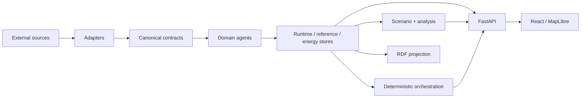

# Berlin Urban Intelligence

**Version 0.1.0**

Berlin Urban Intelligence is a research-oriented, agent-extensible urban intelligence and digital-twin integration platform for Berlin. It integrates heterogeneous urban sources behind typed canonical contracts, preserves provenance/quality/freshness semantics, and supports deterministic cross-domain workflows and explicit hypothetical scenarios without fabricating missing production data.

## Overview

The platform currently integrates selected mobility, environmental exposure, heat, energy and resilience capabilities. Its central design requirement is semantic traceability: an observation, official model output, forecast, derived result and scenario value remain distinguishable throughout processing and presentation.

The repository is the maintained integration layer. Historical standalone prototypes are reference/migration inputs, not runtime dependencies.

Start with the [documentation index](docs/index.md), [project overview](docs/overview.md) and [objectives/scope](docs/objectives-and-scope.md).

## Motivation

Urban sources differ in update cadence, spatial resolution, authority, quality and epistemic meaning. Treating all inputs as interchangeable values can make stale data appear current, models appear measured, or unavailable domains appear complete through undocumented defaults.

Berlin Urban Intelligence makes those distinctions part of the executable data contract. See [Motivation](docs/motivation.md).

## Key capabilities

| Area | Current implementation |
|---|---|
| Canonical contracts | Frozen Pydantic models with explicit data state, quality, UTC time, units, CRS and provenance. |
| Live acquisition | Independent Berlin air-quality, DWD and VBB GTFS-Realtime refresh with source status and last-known-good semantics. |
| Reference acquisition | Official facility/climate WFS data, VBB static GTFS and optional OSM road topology. |
| Domain agents | Live State, Mobility, Exposure, Heat, Energy and Resilience agents with machine-readable descriptors/health. |
| Energy | Chronological holdout evaluation against persistence/seasonal baselines plus Ridge/gradient boosting; fingerprint-bound one-step forecast artefacts. |
| Resilience | Multi-edge weighted routing, route comparison, facility snapping and accessibility under immutable scenario overlays. |
| Scenarios | Explicit bounded heat, energy-demand, network-disruption and infrastructure-degradation scenarios. |
| Orchestration | Five fixed deterministic workflow mappings; no LLM is required for execution. |
| Cross-domain assessment | Independent Heat/Energy/Resilience dimensions with explicit unavailable/error state and no composite score. |
| Semantic layer | RDF projection with project ontology, PROV-O/SOSA usage, SHACL artefacts and version-controlled SPARQL query. |
| Interfaces | FastAPI backend and React/TypeScript/MapLibre research dashboard. |
| Verification | Strict type/lint/format gates, backend/frontend tests, semantic/data/secret guards and running Compose HTTP smoke test. |

Capabilities can be conditional on data. Energy remains unavailable until a Berlin-scoped evaluation/forecast artefact is created; Resilience routing requires a persisted network snapshot.

## System architecture



Provider acquisition is explicit and separate from HTTP request handling. The API loads persisted snapshots at process startup. See [Architecture](docs/architecture/overview.md), [components](docs/architecture/components.md) and [data flow](docs/architecture/data-flow.md).

## Repository structure

```text
config/                         source registry
data/                           generated/runtime data boundary
docs/                           technical and research documentation
frontend/                       React + TypeScript + MapLibre dashboard
knowledge/                      ontology, SHACL and SPARQL artefacts
scripts/                        acquisition/evaluation/validation commands
src/berlin_urban_intelligence/  backend implementation
tests/                          deterministic backend tests
```

See [Project structure](docs/implementation/project-structure.md).

## Quick start

### Docker Compose

```bash
docker compose run --rm refresh
docker compose up --build backend frontend
```

Then open:

- dashboard: `http://localhost:8080`
- OpenAPI: `http://localhost:8000/docs`

If you generate `reference.json` or another state file **after** the backend has started, restart the backend because state is loaded at startup:

```bash
docker compose restart backend
```

For local Python/Node installation, reference layers and optional OSM, see [Installation](docs/usage/installation.md) and [Quickstart](docs/usage/quickstart.md).

## Example workflow

Acquire current state:

```bash
python scripts/refresh_live.py
```

Acquire official reference layers and VBB static GTFS:

```bash
python scripts/refresh_reference.py
```

Run the API:

```bash
uvicorn berlin_urban_intelligence.api.app:app --host 0.0.0.0 --port 8000
```

Inspect domain/source health:

```bash
curl http://localhost:8000/api/v1/agents/health
curl http://localhost:8000/api/v1/source-status
```

More examples, including scenarios and resilience requests: [Usage examples](docs/usage/examples.md).

## Testing

Backend CI uses Python 3.12 and runs formatting, linting, strict mypy, pytest with coverage reporting, ontology validation, production-data/secret guards and OpenAPI generation. Frontend CI uses Node 22, `npm ci`, Vitest and the production build. A final job builds/starts the Compose backend/frontend and verifies HTTP health/proxy behavior.

External-provider compatibility is tested separately so upstream outages do not make deterministic tests nondeterministic. See [Testing strategy](docs/development/testing.md).

## Documentation

The documentation is organized for external engineering/research use:

- [Documentation index](docs/index.md)
- [Concepts and terminology](docs/concepts/terminology.md)
- [Architecture](docs/architecture/overview.md)
- [Data architecture](docs/data/overview.md)
- [Implementation](docs/implementation/modules.md)
- [Usage](docs/usage/quickstart.md)
- [Development](docs/development/development-setup.md)
- [Evaluation](docs/evaluation/methodology.md)
- [Research/reproducibility](docs/research/reproducibility.md)
- [Roadmap](docs/roadmap.md)
- [Architecture Decision Records](docs/adr/)

## Current status

**Implemented:** typed cross-domain contracts; configured data adapters; live/reference acquisition; domain agents; scenario/resilience calculations; energy evaluation/forecast pipeline; deterministic orchestration; RDF projection; persisted snapshots; API/dashboard; CI/container verification.

**Experimental/conditional:** live provider compatibility, OSM-backed routing, Berlin energy forecasting for explicitly supplied source publications, cross-domain scenario assessment.

**Not currently implemented/claimed:** continuous streaming state, municipal operations/control, universal Berlin score, causal cross-domain inference, calibrated energy prediction intervals, persistent SPARQL service, distributed remote-agent protocol, API authentication/authorization, production-scale performance validation.

Quantitative scientific evaluation is currently strongest in the energy workflow. Broader architecture/scenario/scalability evaluation remains future research. See [Evaluation results](docs/evaluation/results.md) and [limitations](docs/evaluation/limitations.md).

## Roadmap

Planned work is separated from current capability in [docs/roadmap.md](docs/roadmap.md). Items move to “implemented” only when code, tests and corresponding documentation exist.

## Data sources and licences

`config/sources.yaml` is the machine-readable source registry and documents provider scope, URLs, authority, licence/attribution and known limitations. External datasets retain their own licensing/attribution requirements. See [Data sources](docs/data/data-sources.md).

## License

No project-source licence is currently present in the repository. Do not infer a project-source licence from external dataset licences. A formal project-source licence should be added deliberately before redistribution/use terms are claimed.
