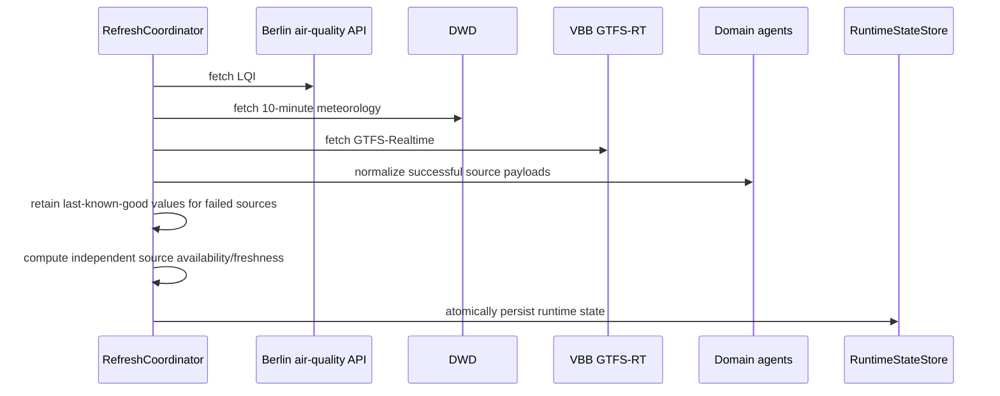
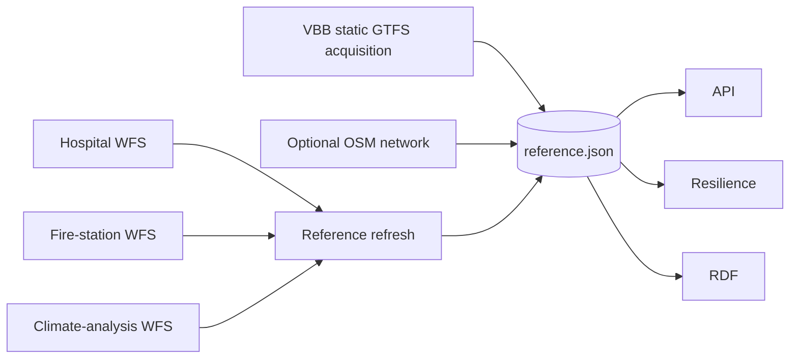
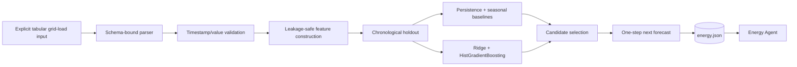
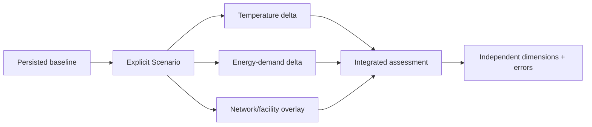

# Data flow

The platform uses separate flows for current observations, slower reference state, evaluated energy forecasts and hypothetical scenario results. They converge only at explicit analytical/API boundaries.

## Live/current state

Each source is attempted independently. A source failure is recorded without deleting unrelated valid observations. When previous state exists, values from a failed source may remain as last-known-good while its current availability becomes unavailable and freshness continues to age.

## Reference state

The default WFS refresh selects verified climate layers rather than downloading every advertised layer. If one reference source fails and a previous state exists, its previously valid category/layer can be retained independently.

Static VBB stops and optional OSM network acquisition are performed by reference-acquisition logic around the reference store rather than by the live refresh coordinator.

## Energy evaluation and forecast

All candidate metrics are computed on the same chronological holdout. The dataset content is fingerprinted. API-visible forecast registration requires the persisted evaluation model identity and dataset fingerprint to match the forecast artefact.

## Scenario analysis

Scenarios do not modify persisted baseline state. Unsupported/missing prerequisites become explicit unavailable dimensions or derivation failures. The current assessment contract fixes `composite_score` to `null`.

## API request flow

The backend loads runtime, reference and energy snapshots during FastAPI startup. A request then operates only on those in-memory objects and deterministic domain services. Provider network calls are not performed inside normal API handlers.

Every request receives an operation UUID returned in `X-Operation-Id`; the middleware emits a structured log with operation ID, error state and duration. Arbitrary request payloads/query strings are not added by the structured-log formatter.

## Semantic projection

Canonical objects are projected into an in-memory RDF graph on request. Observations use SOSA terms where applicable; provenance uses PROV-O relationships; project-specific terms represent the remaining domain semantics. Generated RDF is a projection and does not replace the JSON/canonical persistence boundary.

## Data-flow constraints

Across flows, the following transformations are prohibited unless explicitly implemented and recorded:

- missing value -> zero;
- unavailable source -> fabricated observation;
- official model -> observed measurement;
- scenario -> baseline observation;
- non-Berlin reference dataset -> Berlin operational state;
- unvalidated forecast artefact -> registered Berlin forecast;
- longitude/latitude degree distance -> metric snapping distance without CRS transformation.
