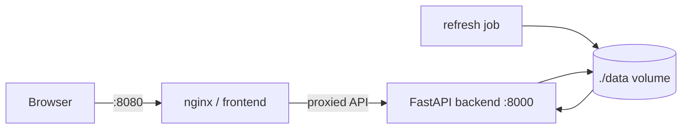

# Deployment

## Default topology

The repository ships a Docker Compose topology for backend, frontend and an on-demand live refresh job.



### Backend

Built from the repository `Dockerfile` using `python:3.12-slim`. The image installs `.[live]`, runs as non-root `appuser`, exposes port 8000 and starts:

```text
uvicorn berlin_urban_intelligence.api.app:app --host 0.0.0.0 --port 8000
```

The compose health check requests `http://127.0.0.1:8000/health` every 15 seconds with five retries.

### Frontend

Built from `frontend/Dockerfile`. The production Vite build is served by nginx. The frontend service waits for a healthy backend and maps host port 8080 to container port 80. nginx proxies backend routes according to `frontend/nginx.conf`.

### Refresh job

The compose `refresh` service uses the backend image and executes:

```text
python scripts/refresh_live.py --state /app/data/runtime/state.json --rdf /app/data/generated/latest.ttl
```

It is an explicit job, not a continuously running scheduler.

## Volumes and state

Backend and refresh mount:

```text
./data:/app/data
```

This makes runtime snapshots survive container replacement on the host. The repository does not configure a database service.

Reference and energy state use application defaults under `/app/data/runtime/` unless environment overrides are supplied.

## Ports

| Service | Container | Host |
|---|---:|---:|
| Backend | 8000 | 8000 |
| Frontend/nginx | 80 | 8080 |

## State refresh lifecycle

The backend reads persisted state during FastAPI startup. A refresh job that writes new files while the backend is already running does **not** update the in-memory snapshot. Restart/reload the backend after refreshing state that should become visible to requests.

This behavior should be considered in any production scheduler design.

## Health vs readiness

`/health` indicates process health and version. `/ready` indicates whether at least a runtime or reference snapshot was loaded. It can return 503 even when `/health` is healthy.

Agent availability is a third layer and should be inspected through `/api/v1/agents/health`.

## CI deployment verification

The container CI job:

1. validates Compose configuration;
2. builds backend and frontend images;
3. starts backend/frontend with Compose;
4. waits for backend `/health`;
5. checks the frontend root page; and
6. checks the nginx-proxied `/health` route.

This verifies startup and HTTP connectivity, not only Dockerfile syntax/buildability.

## Scheduling

No production scheduler is committed for live/reference/energy refreshes. A deployment requiring periodic acquisition must provide scheduling externally (for example an operating-system timer or orchestration platform) and should account for backend snapshot reload behavior.

## Security boundary

Current configured provider sources are public and require no committed credentials. Future secrets should be injected through deployment secret mechanisms rather than source-controlled environment files. The container runs the application as a non-root user, but the repository does not currently implement API authentication/authorization; deployment into an untrusted public environment therefore requires an external access-control decision.

## Scalability

The default deployment is single-process/snapshot-oriented and has not been benchmarked as a horizontally scaled production service. Large reference collections are paginated at the API, but the backend currently loads persisted reference/runtime state into process memory. Scaling claims beyond this topology require measurement.
