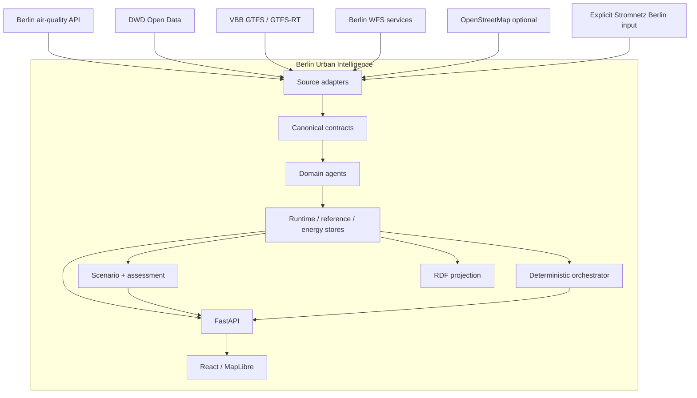
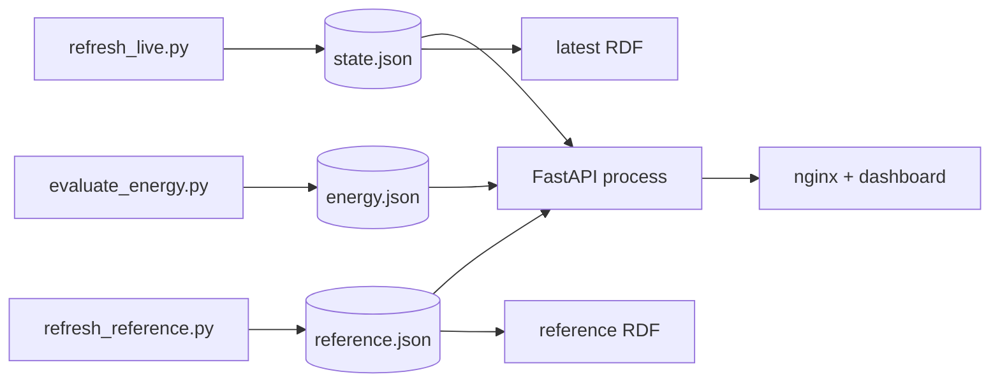

# Architecture overview

Berlin Urban Intelligence is a modular monorepo whose primary integration boundary is the canonical contract layer. Domain capabilities are implemented in separate modules and coordinated without requiring distributed services or an LLM in version 0.1.0.

## System context

## Architectural layers

1. **Source adapters** isolate external access and parsing assumptions.
2. **Canonical contracts** define versioned state, quality, provenance, time and spatial constraints.
3. **Domain agents** encapsulate domain behavior and health semantics.
4. **Acquisition/evaluation coordinators** execute explicit source refreshes and energy evaluation.
5. **Persisted stores** separate live runtime state, reference state and evaluated energy state.
6. **Scenario and resilience services** run calculations against explicit baselines without modifying stored baseline state.
7. **Deterministic orchestration** maps supported workflow kinds to fixed agent combinations and reports health.
8. **Knowledge projection** maps canonical state and lineage to RDF.
9. **FastAPI** exposes persisted state and analysis contracts.
10. **React/MapLibre dashboard** consumes HTTP API outputs and does not perform provider acquisition.

## Architectural invariants

The current implementation enforces the following invariants:

- missing production measurements are not replaced with synthetic measurements;
- observed, official-modelled, project-modelled, forecast, derived and scenario state remain distinct;
- numeric canonical observations/derived values require explicit units;
- cross-boundary datetimes are timezone-aware and normalized to UTC;
- WGS84 is used for interchange, with explicit projected CRS for metric calculations;
- scenario overlays do not mutate persisted baseline state;
- source availability and freshness are tracked separately;
- independent source failures do not delete unrelated valid state;
- forecast registration requires model identity and dataset fingerprint consistency with its evaluation;
- integrated assessment does not manufacture a composite cross-domain score.

## Runtime topology

Acquisition is deliberately separate from request serving. The API loads the persisted state files at application startup. This makes request behavior deterministic with respect to a known snapshot but means a running process must be restarted/reloaded after persisted files are replaced.

## Deployment style

The default repository deployment is a small composed application rather than a microservice mesh:

- one Python backend container;
- one static frontend/nginx container;
- one on-demand `refresh` container for live acquisition;
- host-mounted `data/` for generated runtime artefacts.

Reference acquisition and energy evaluation are explicit commands rather than continuously scheduled services in `docker-compose.yml`.

## Why a modular monorepo

The accepted monorepo ADR treats the repository as an integration boundary rather than a domain monolith. The current design avoids runtime coupling to historical prototype repositories and provides one CI pipeline and one contract surface. Distributed messaging remains a possible future transport layer, but stable semantics are intentionally established first.

## Detailed views

- [Components](components.md)
- [Data flow](data-flow.md)
- [Interfaces](interfaces.md)
- [Deployment](deployment.md)
- [Design decisions](design-decisions.md)
