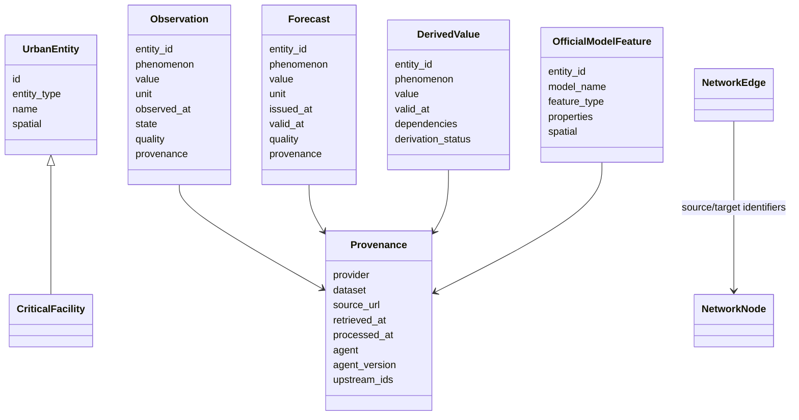

# Domain model

The domain model is defined by the canonical Pydantic contracts in `src/berlin_urban_intelligence/shared/contracts.py`. These contracts are the cross-domain semantic boundary; provider-specific records remain inside adapters or domain ingestion methods.

## Core relationships

## Canonical objects

| Contract | Purpose | Important constraints |
|---|---|---|
| `UrbanEntity` | Identified real-world/reference object. | Optional validated spatial reference and source identifier. |
| `Observation` | Measured or declared observation. | Timezone-aware UTC time; numeric values require a unit; cannot use forecast/scenario/unavailable state. |
| `DerivedValue` | Project-derived quantity. | Restricted to derived/interpolated/project-modelled state; explicit dependencies and derivation status. |
| `Forecast` | Time-targeted prediction. | Unit required; issue/valid times; paired uncertainty bounds if supplied; value must lie inside bounds. |
| `ScenarioValue` | Explicit hypothetical quantity. | Always scenario state and tied to a scenario identifier. |
| `OfficialModelFeature` | Geometry/properties from official external model output. | Always official-modelled state; explicit quality, provenance and spatial reference. |
| `NetworkNode` | Network vertex. | Longitude and latitude are either both supplied or both absent. |
| `NetworkEdge` | Directed/bidirectional network relation. | Positive travel time and length; stable source/target identifiers. |
| `CriticalFacility` | Facility reference entity. | Category and quality; location does not imply operational status. |
| `AgentDescriptor` | Machine-readable component metadata. | Identifier, version, capabilities, input/output contracts and source dependencies. |
| `AgentHealth` | Current agent health. | Availability, freshness, quality and timezone-aware check time. |

The canonical contract version is currently `1.0.0`.

## Provenance model

`Provenance` is attached to observations, forecasts, derived values and official-model features. It records provider, dataset, source URL, source identifier where available, observation/retrieval/processing times, processing method, producing agent/version, optional model version, licence, quality note and upstream identifiers.

Processing time cannot precede retrieval time, and all canonical timestamps crossing boundaries must be timezone-aware.

## Spatial model

`SpatialReference` contains a CRS identifier and optional GeoJSON geometry. CRS strings are validated through `pyproj`; geometry is validated through Shapely. EPSG:4326 geometry is additionally checked against longitude/latitude bounds.

Interchange geometry is normally WGS84. Resilience distance and facility-snapping calculations transform coordinates into EPSG:25833 by default before calculating metric distances.

## Temporal model

The project differentiates observation time, retrieval time, processing time, forecast issue time and forecast validity time. These are not aliases. Source runtime status additionally records last retrieval attempt, last successful retrieval and latest observation time.

## Identity

Canonical identifiers are stable strings constructed by adapters/agents from source identifiers and domain context. RDF projection maps those identifiers into project resource IRIs. The repository does not currently implement a global entity-resolution service that reconciles arbitrary provider identifiers across domains.

## Domain boundaries

The current data model intentionally avoids inferring semantics that sources do not provide. Examples include facility operational availability, total-city energy demand from a network-level curve, and street-level climate precision from model layers whose resolution does not justify it.
