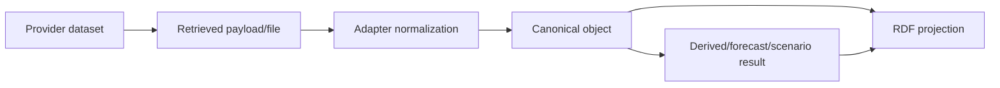

# Data provenance

Provenance is a required part of canonical analytical state. It is intended to make a result traceable to its provider, dataset, transformation and producing component without requiring source-code archaeology.

## Canonical provenance fields

`Provenance` can record:

- provider and dataset;
- source URL;
- original source identifier;
- observation time when applicable;
- retrieval and processing time;
- processing method;
- producing agent and agent version;
- optional model version;
- source licence;
- quality note; and
- upstream canonical identifiers.

Retrieval/processing times are normalized to UTC, and processing cannot precede retrieval.

## Provenance chain

Canonical provenance records source identity and the relevant processing method. Derived values can additionally carry explicit dependency IDs. The knowledge projection maps source and generation relationships with PROV-O.

## Runtime source status vs provenance

Runtime availability/freshness is not stored only inside historical provenance. `SourceRuntimeStatus` records current/last retrieval state separately. This matters because a retained last-known-good observation can have valid historical provenance while its provider is currently unavailable.

## Energy lineage

Energy evaluation adds a content fingerprint. `fingerprint_frame()` computes SHA-256 over canonical timestamp/value content and column names. The forecast artefact carries the same dataset fingerprint and selected model ID; `EnergyAgent.register_forecast()` rejects a mismatch.

This prevents an evaluation from one input snapshot from being silently reused as evidence for a forecast generated from a different snapshot.

## Reference lineage

Facilities and official climate features retain provider/dataset/source identifier information. Climate geometry repair is written into `processing_method` and quality notes rather than being invisible. Optional network speed imputation must likewise remain identifiable as a derived processing choice.

## RDF lineage

`KnowledgeGraph._add_provenance()` creates:

- a source resource typed as `bui:DataSource` and `prov:Entity`;
- a generation activity typed as `prov:Activity`;
- `prov:wasDerivedFrom` from the canonical value to the source/upstream resources; and
- `prov:wasGeneratedBy` from the value to the processing activity.

The ontology and SHACL artefacts under `knowledge/ontology/` define/validate the semantic layer used by repository checks.

## Operational traceability

API middleware creates a UUID operation ID for each HTTP request and returns it in `X-Operation-Id`. Structured logging records the operation ID, agent/source/error context and duration from an allow-list of fields. The formatter intentionally ignores arbitrary extra context, reducing the risk of request bodies or query strings entering logs accidentally.

## Reproducibility limitations

Provenance improves traceability but does not itself archive external datasets. Public providers can change or remove data. Reproducing a historical result therefore requires the original input snapshot or an upstream source that still serves the exact data, plus the recorded processing configuration/version.

For research runs, retain the relevant source snapshot or immutable source reference when licensing permits, the repository commit, generated state metadata and command/configuration used.
