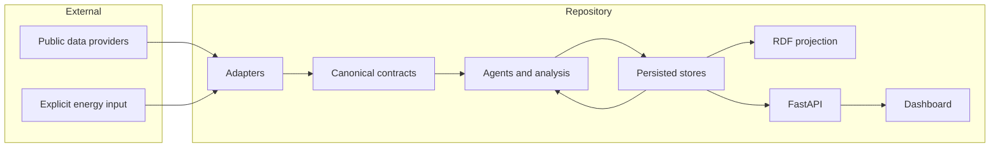

# Objectives and scope

## Primary objectives

Berlin Urban Intelligence is intended to:

1. integrate heterogeneous Berlin urban datasets behind versioned canonical contracts;
2. preserve source identity, provenance, quality, freshness, temporal meaning and spatial reference across processing boundaries;
3. keep domain agents independently testable while enabling deterministic cross-domain workflows;
4. isolate source failures so unavailable providers do not invalidate unrelated state or trigger fabricated replacement data;
5. support reproducible, explicit scenario analysis without mutating observed or reference baselines;
6. expose inspectable state and analytical outputs through a versioned HTTP API, semantic projection and research dashboard; and
7. provide documented extension points for additional sources, domains, agents, models and interfaces.

## Secondary objectives

Supporting objectives include:

- machine-readable source metadata in `config/sources.yaml`;
- reproducible container and frontend builds;
- structured operational logging with correlation identifiers;
- RDF lineage projection using established vocabularies where appropriate;
- chronological and leakage-safe evaluation for the implemented energy forecasting workflow;
- preservation of historical prototype ideas without runtime dependency on prototype repositories.

## Non-goals

The current system deliberately does **not** attempt to provide:

- a complete or continuously available digital replica of Berlin;
- authoritative municipal operations, dispatch or infrastructure control;
- a universal city health, resilience or desirability score;
- causal inference from cross-domain correlations or scenario comparisons;
- automatic substitution of missing observations with generated data;
- live operational status for hospitals or fire stations from location datasets;
- total Berlin electricity demand when the configured publication represents a specific distribution-grid level;
- calibrated forecast uncertainty intervals;
- guaranteed street/building-level precision beyond source resolution;
- LLM-dependent planning or numerical reasoning in the execution core; or
- a distributed multi-service agent protocol in version 0.1.0.

## Geographic scope

The operational focus is Berlin. Some source boundaries cover a wider region where required by the provider, notably VBB data for Berlin and Brandenburg and DWD data published nationally. Wider coverage does not expand the analytical claim beyond the explicitly selected Berlin-relevant inputs.

The UCI household electricity dataset is retained only as a methodology/reference source and is outside Berlin operational state.

## Temporal scope

The platform combines three broad temporal classes:

- **current/realtime state**, such as DWD observations, Berlin air-quality values and VBB GTFS-Realtime;
- **slow-changing reference/model state**, such as facilities, static GTFS stops and Climate Analysis 2022 features; and
- **evaluated forecasts/scenarios**, which are future or hypothetical and remain explicitly labelled.

The API serves persisted snapshots loaded at process startup. It is not a streaming state engine.

## System boundary

Upstream collection infrastructure and provider quality-control processes are outside the repository. Downstream policy decisions and operational interventions are also outside the repository.

## Assumptions

Major assumptions are maintained in [research/assumptions.md](research/assumptions.md). The most important architectural assumptions are that source semantics can be normalized without erasing provenance, explicit snapshots are acceptable for the current research workflows, and consumers are able to treat epistemic state and quality metadata as part of the result rather than optional decoration.

## Status language

Documentation uses the following status distinctions:

- **Implemented** — executable code is present and covered by repository verification appropriate to the feature.
- **Conditional** — implemented code exists but useful output requires external data or an optional dependency.
- **Experimental** — implemented for research use but not supported by a broad empirical validation claim.
- **Planned** — documented future work with no claim of current implementation.

These labels should be preferred over ambiguous phrases such as “supported” when source availability or optional data materially affects behavior.
