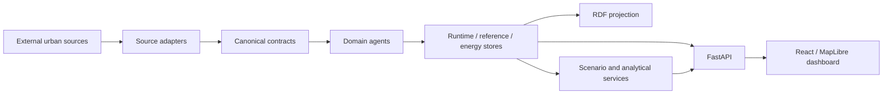

# Project overview

## Purpose

Berlin Urban Intelligence provides a common integration layer for heterogeneous Berlin urban data and analytical capabilities. The platform normalizes provider-specific data into versioned canonical contracts, preserves provenance and data-state semantics, exposes domain capabilities through independently testable agents, and supports explicit scenario analysis without rewriting the observed/reference baseline.

The project is research-oriented. It is designed to make cross-domain urban analysis technically inspectable and reproducible rather than to present a continuously complete or authoritative representation of the city.

## Problem domain

Urban analysis commonly combines data that differ in provider, update cadence, spatial resolution, quality status and epistemic meaning. A current weather observation, an official climate-model feature, a timetable, a realtime transit update, a model forecast and a hypothetical disruption are all useful, but they cannot be treated as equivalent facts.

The platform addresses this integration problem by carrying state, quality, time, space and provenance as part of the data contract rather than as implicit application context.

## Intended users

The current repository is primarily suitable for:

- software engineers extending or operating the integration platform;
- researchers evaluating urban digital-twin architecture and cross-domain workflows;
- developers of additional domain agents, source adapters or analytical modules;
- technically experienced users inspecting Berlin urban-state and scenario outputs.

It is not designed as an end-user emergency, dispatch or infrastructure-control system.

## Implemented capability areas

The maintained implementation contains the following capability areas:

| Area | Implemented role |
|---|---|
| Live state | Aggregates domain health and availability without generating missing values. |
| Mobility | Normalizes VBB GTFS-Realtime state and retains static GTFS reference stops separately. |
| Environmental exposure | Normalizes official Berlin LQI records with provisional-quality semantics. |
| Urban heat | Normalizes DWD meteorology and separately represents Berlin Climate Analysis features as official model output. |
| Energy | Evaluates explicitly supplied Berlin grid-load series chronologically and registers only model/fingerprint-consistent forecasts. |
| Resilience | Performs weighted routing, accessibility and network-disruption analysis over persisted network/facility inputs. |
| Scenarios | Applies bounded, explicit hypothetical changes to supported baseline quantities and network/facility state. |
| Orchestration | Selects fixed typed workflow combinations and reports agent health deterministically. |
| Knowledge projection | Projects canonical objects and lineage into RDF using the project ontology plus reused semantic vocabularies. |
| API/UI | Exposes persisted state and analyses through FastAPI and a React/MapLibre research dashboard. |

## System boundary

The system starts at configured external source boundaries or explicitly supplied energy input and ends at canonical persisted state, analytical results, RDF projection, HTTP API responses and dashboard presentation.

External data publishers remain responsible for their source measurements and availability. The platform does not control upstream collection processes. The API does not fetch providers during normal requests; acquisition is performed explicitly by refresh/evaluation commands and persisted snapshots are loaded when the API process starts.

Historical standalone prototype repositories are not runtime dependencies. Reusable concepts are implemented inside this repository behind the shared contract surface.

## High-level workflow

Live, reference and energy state use separate persistence boundaries because their semantics and update cadences differ. Scenario calculations operate on explicit baselines and return separate scenario results rather than mutating those stores.

## Current maturity

Version 0.1.0 has deterministic unit/integration tests, type/lint/format gates, frontend tests/build checks, ontology validation and container HTTP smoke testing. Separate live-source workflows check current provider compatibility. The repository has stronger implementation verification than scientific system-level evaluation: only the energy forecasting workflow currently contains a formal quantitative model comparison against explicit baselines. Broader cross-domain effectiveness, scalability and user-impact evaluation remain future research work.
